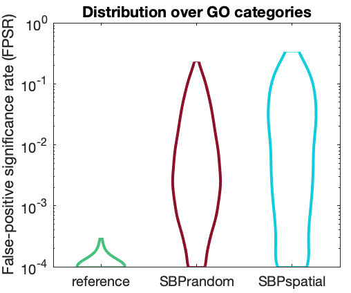
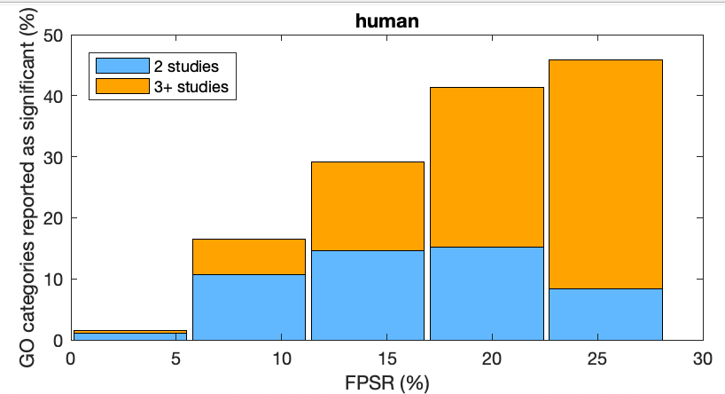
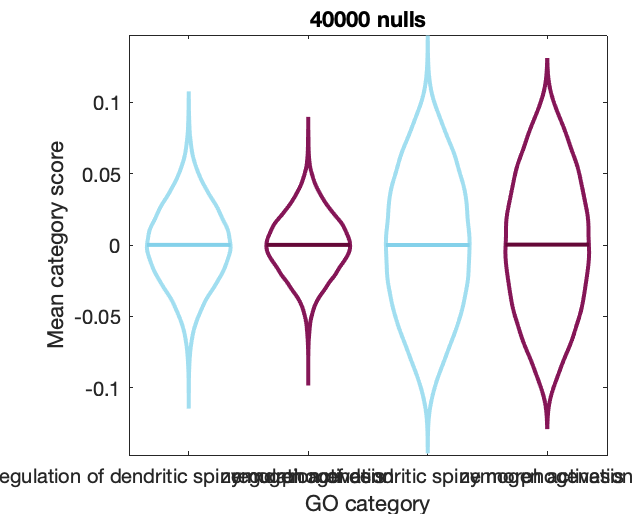
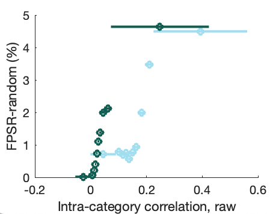
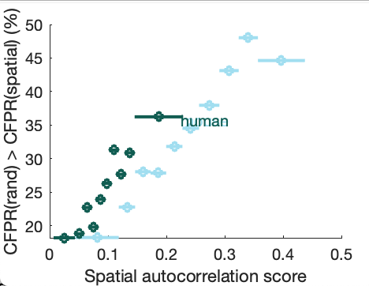

# Enrichment Nulls
EnrichmentNulls is a repository for reproducing enrichment analyses for spatial maps in human and mouse.

## Setting up

### Raw gene-expression data

The directory `/HumanData` requires three data files:
* `100DS220scaledRobustSigmoidNSGDSQC1LcortexSubcortex_ROI_NOdistCorrSurfaceANDEuclidean.mat`
* `100DS220scaledRobustSigmoidNSGDSQC1LcortexSubcortexSEPARATE_ROI_NOdistCorrSurfaceANDEuclidean.mat`
* `100DS360scaledRobustSigmoidNSGDSQC1Lcortex_ROI_NOdistCorrSurface.mat`

The directory `/MouseData` requires:
* `AllenGeneDataset_19419.mat`

### Data and code for running gene set enrichment analysis (GSEA)

This relies on a [Matlab toolbox for GSEA](https://github.com/benfulcher/GeneSetEnrichmentAnalysis), which can be installed by cloning:
```bash
git clone git@github.com:benfulcher/GeneSetEnrichmentAnalysis.git
```
Analyses here require it to be accessible in the path, which can be set by modifying `GiveMeFile` (`'EnrichmentToolbox'`).

Please follow the instructions from that repository to recompute (or download) the following required data files:
* Direct biological process annotations: `GOTerms_BP.mat`
* Hierarchically propagated annotations (mouse): `GOAnnotationDirect-mouse-biological_process-Prop.mat`
* Hierarchically propagated annotations (human): `GOAnnotationDirect-human-biological_process-Prop.mat`

## Data processing and precomputing

Note that batch job scripts for major bulk computations are in the `BatchComputing` directory.
There are files for mouse-related analyses: `batchAllMouseAnalyses.sh`, and human-related analyses: `batchAllHumanAnalyses.sh`.

### Literature enrichment signatures

Information about enrichment results reported in published studies can be imported and processed by running
```matlab
ImportLiteratureEnrichment(false,true);
```
Results are saved as `LiteratureEnrichmentLoaded.mat`.
All data is read in from the `LiteratureEnrichmentData` directory.

<!--
First type of annotations are manually-curated, from studies that noted enrichment results in-text with no supplementary files for full results: `TableGOBPs.csv`:

The second type are using scripts (in `/DataProcessing/IndividualEnrichmentImportScripts/`) to directly process data provided as supplementary material from the following studies:
* `WhitakerReformatted.xlsx`: Whitaker, K. J. et al. Adolescence is associated with genomically patterned consolidation of the hubs of the human brain connectome. _Proc. Natl. Acad. Sci. USA+ **113**, 201601745–9110 (2016).
* `Vertes-rstb20150362supp1.xlsx`: Vértes, P. E. et al. Gene transcription profiles associated with inter-modular hubs and connection distance in human functional magnetic resonance imaging networks. _Phil. Trans. Roy. Soc. B_ **371**, 20150362 (2016).
* `Fulcher2016_connectedUnconnected_BP_TableS1.csv`, `Fulcher2016_richFeederPeripheral_BP_TableS5.csv`: Fulcher, B. D. & Fornito, A. A transcriptional signature of hub connectivity in the mouse connectome. _Proc. Natl. Acad. Sci. USA_ **113**, 1435–1440 (2016).
* `Tan2013-table-s6-david-200pos-transport.csv`: Tan, P. P. C., French, L. & Pavlidis, P. Neuron-Enriched Gene Expression Patterns are Regionally Anti-Correlated with Oligodendrocyte-Enriched Patterns in the Adult Mouse and Human Brain. Front. Psychiat. 7, (2013).
* `Parkes2017_PC1.txt`, `Parkes2017_PC2.txt`, `Parkes2017_PC5.txt`, `Parkes2017_PC9.txt`: 1.	Parkes, L., Fulcher, B. D., Yücel, M. & Fornito, A. Transcriptional signatures of connectomic subregions of the human striatum. _Genes, Brain and Behavior_ **25**, 1176–663 (2017). -->

### False-Positive Significance Rates (FPSR)

False-positive significance rates can be computed using `SurrogateEnrichment` (cf. in `batchAllHumanAnalyses` and `batchAllMouseAnalyses`).

```matlab
% Spatially random model (plus independent shuffling of space, separately per gene) [should be no signal---a real null of correlated noise with noise]:
SurrogateEnrichment('mouse',[],'randomUniform','independentSpatialShuffle');
% Spatially random model:
SurrogateEnrichment('mouse',[],'randomUniform','');
% Spatial lag model:
SurrogateEnrichment('mouse',[],'spatialLag','');
% (and similarly for 'human')
```

There is also the (irrelevant) spatially random model (plus coordinated shuffling of genes through space) [equivalent to not doing a coordinatedSpatialShuffle]:
```matlab
SurrogateEnrichment('mouse',[],'randomUniform','coordinatedSpatialShuffle');
```

The computed results are saved a `.mat` files and can be read in and processed as a GO Table using `SurrogateEnrichmentProcess`.


### Ensemble-based null distributions

Null distributions for all GO categories is done using the companion Matlab package for both conventional gene-score enrichment and ensemble-based enrichment.

For example, below computes for `'mouse'` with the 'randomMap' null model with all other parameters set to defaults:

```matlab
params = GiveMeDefaultParams('mouse');
params.e.whatEnsemble = 'randomMap';
% Wrapper for running ensemble-based nulls using appropriate gene-expression data:
NullComputation(params);
```

The null distribution for all GO categories is stored in a table that is saved to a `.mat` file, in this case: `PhenotypeNulls_40000_mouse_randomMap_Spearman_mean.mat`.
These stored null distributions can then be used for ensemble-based GSEA.

### Intra-category coexpression

The within-category coexpression metric is precomputed as:

```matlab
IntraCorrelationByCategory('mouse','geneShuffle',[],'raw',true);
IntraCorrelationByCategory('human','geneShuffle',[],'raw',true);
```
(although the shuffled versions aren't in any analyses, so the computation on shuffled data is needless).

This saves the results in the `DataOutputs` directory.

### Compute spatial autocorrelation scores

Computes spatial autocorrelation scores for each GO category and each species (ready for subsequent analysis):
```matlab
ComputeSpatialEmbeddingScores();
```

### Generate ensembles of spatially autocorrelated brain maps

#### Matlab

```matlab
params = GiveMeDefaultParams();
numMaps = params.e.numNullSamples;
plotSummary = true;
GenerateSpatialEnsemble('mouse','all',plotSummary,numMaps)
GenerateSpatialEnsemble('mouse','cortex',plotSummary,numMaps)
GenerateSpatialEnsemble('human','cortex',plotSummary,numMaps)
```

#### Python (old)
First generate pairwise distance matrices for the regions in human cortex and mouse brain:
```matlab
SaveOutDistanceMatrices
```
This generates `mouseDistMat.csv` and `humanDistMat.csv`.
These files can be used as input to python code by [Josh Burt et al.](https://github.com/benfulcher/surrogateMaps).
For example, here:
```
python3 GenerateMapsFixed.py
```

The outputs, `mouseSurrogate_N10000_rho8_d040.csv` and `mouseSurrogate_rho10.csv`, are spatially correlated null maps that can be visualized in Matlab. For example:
```matlab
VisualizeSurrogateMaps('mouse');
```

## Analysis

### Enrichment signatures of ensembles of random spatial phenotypes (and/or including spatial autocorrelation)

#### Plot distributions of FPSE across GO categories for the three null cases
```matlab
NullEnrichmentTogether('mouse',[],true)
NullEnrichmentTogether('human',[],true)
```



#### Generate a table with key statistics of FPSE in mouse and human
```matlab
FPSRTable();
```

#### Investigate the overlap between literature annotations and FPSE as histograms:
```matlab
OverlapLitFPSR('mouse')
OverlapLitFPSR('human')
```


### Specific GO categories

You can zoom into the null score distributions of two specific GO categories using:

```
PlotCategoryNullCompare('human')
```


### The role of intra-category coexpression

Generate a table of intra-category coexpression (`WithinCategoryCoexp.csv`):
```matlab
IntraCorrTable();
```

Does intra-category coexpression relate to FPSR?:
```matlab
IntraCorrFPSR();
```


Do categories with spatially autocorrelated genes exhibit an increase in FPSR against spatially autocorrelated ensembles?

Investigate how FPSR is correlated to gene spatial autocorrelation (by category)
```matlab
RelativeFPSRAutoCorr()
```


Save scores to table and get some additional visualizations:
```matlab
DistanceConfoundResults()
```

### Case Study: Degree

***First compute all conventional enrichment results***, will loop through human, mouse-all, and mouse-cortex:
```matlab
RunConventionalEnrichment();
```

Then you can get all of the results (for each of three analyses) as:
```matlab
CaseStudyResults('human','cortex');
CaseStudyResults('mouse','all');
CaseStudyResults('mouse','cortex');
```

This also generates output files `EnrichmentThreeWays*.csv`.

## Peripheral

### Visualizing transcriptional data

Clustered row x gene expression matrices can be plotted for mouse:
```matlab
PlotExpressionMatrix('mouse')
```

And human:
```matlab
PlotExpressionMatrix('human')
```


### Non-specific spatial effects
These analyses look at quantifying nonspecific spatial patterning of gene-expression maps.

```matlab
DistanceConfoundResults()
```
